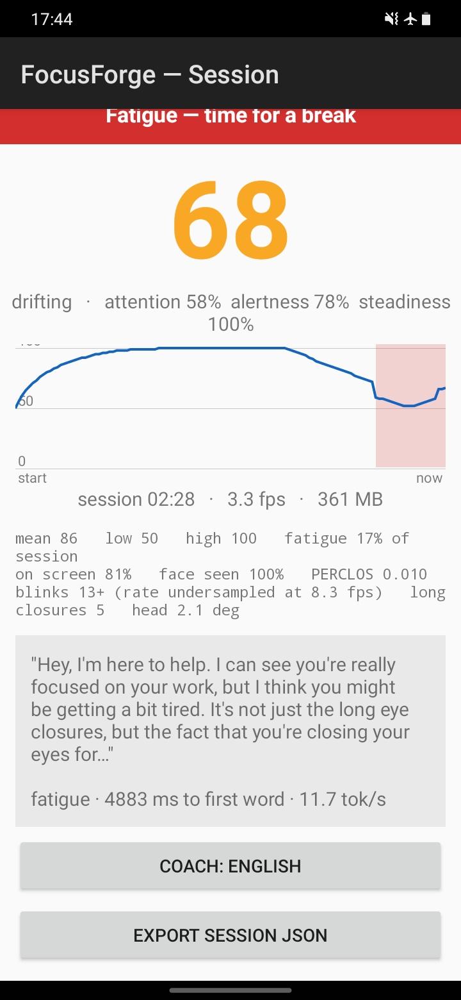

# FocusForge

A focus and fatigue coach that runs entirely on a seven-year-old £120 Android phone. The phone
sits on a stand facing you while you work. A camera pipeline reads behavioural attention
signals, a fusion layer turns them into a live focus score, and a small language model writes
short coaching messages — **all on the device, with no network permission at all**.

Underneath it is [**aarchmage**](governor/), a self-tuning runtime that measures the silicon it
wakes up on, derives its own configuration, and then holds itself to a written performance
contract while it runs.



*Airplane mode on. The message was written by a 360M-parameter model on the phone, in 4.9
seconds, with the camera running. The app tells you what that cost.*

---

## Why this exists

The usual way to make a mobile app fast is to tune it on the device you own and ship the
constants. That produces numbers that are true for one phone and unexamined everywhere else.

We caught ourselves doing it. This project's own written guidance said to run the language
model on two threads aimed at the phone's two fast cores. It was a reasonable assumption from
someone who knew the hardware. When it was finally measured on the target device, **six threads
was 1.85× faster** — the difference between meeting our latency target and missing it by 60%.

Nobody was careless. Measuring it by hand costs an afternoon per device, so it never happened.
**aarchmage measures it in about a minute, on whatever machine it is running on**, and writes
down why it chose what it chose.

## The two devices

| | Samsung Galaxy A20e (2019) | GitHub `ubuntu-24.04-arm` |
|---|---|---|
| SoC | Exynos 7884B | Neoverse-class server part |
| CPU | 2× Cortex-A73 + 6× Cortex-A53 | 4 identical cores |
| ISA | **Armv8.0-A** | Armv8.2+ |
| dotprod / i8mm / SVE | **none of them** | **all of them** |
| RAM | 3 GB | plenty |
| thread sweep it derived | 1, 2, 6, 8 | 1, 2, 4 |
| **configuration it chose** | **6 threads** | **1 thread** |

Same code. Neither number configured by a human. Seven years of Arm CPU design between them,
and the right answer is different in both directions.

---

## What we found

Full detail with links to every artifact: **[docs/RESULTS.md](docs/RESULTS.md)**.

**The smaller model is slower.** Everyone knows a smaller quantisation moves fewer bytes per
token and should win on a bandwidth-limited CPU. On this chip Q4_K_M is **19–35% slower** than
q8_0 — because unpacking a k-quant costs arithmetic that a CPU *with* `dotprod` would hide
behind its matrix multiply, and this one has none. We ship it anyway, because it costs 120 MB
less memory and loads 3.2× faster, and memory is the binding constraint here. Cheapest that
complies, not fastest.

**Time to first token: 9727 ms → 1481 ms**, against a 3000 ms contract. Prompt trimming, KV
cache reuse, standing the vision loop down during generation, and the thread count. Not one
step was a guess: three measurements fit a cost model that predicted six unseen runs to
**within 1.7%**.

**The focus score separates behaviours** across eight labelled recordings — the *worst* focused
session still beats the *best* of any other, and three separate sessions of the same behaviour
scored 96.7, 96.7 and 96.6.

**And the things that do not work** are written down with the same care: blink counts
under-report by ~40% at this frame rate, yawn detection fails outright on this device, PERCLOS
alone misses one genuinely drowsy session, and 8-thread throughput is not reproducible. Those
findings shaped the design more than the successes did.

---

## Setup, from nothing

### On the PC

```bash
git clone --recurse-submodules https://github.com/Biethe/FocusForge.git
cd FocusForge
```

The submodule is llama.cpp pinned to tag `b10227`. If you cloned without `--recurse-submodules`:
`git submodule update --init --depth 1`.

Everything JVM-side runs with no Android SDK at all:

```bash
./gradlew -PcoreOnly :core:test        # signals, focus score, coach policy, replay assertions
./gradlew -PcoreOnly :governor:test    # topology, cost model, self-benchmark, governor
./gradlew -PcoreOnly :governor:deriveProfile   # profile the machine you are sitting at
```

To build the APK you need the Android SDK with **NDK 26.3.11579264** and **CMake 3.22.1**:

```bash
export ANDROID_HOME=~/Android/Sdk
./gradlew assembleDebug
```

Or skip all of that and take the APK from
[the rolling `dev-latest` release](https://github.com/Biethe/FocusForge/releases/tag/dev-latest).

### The model

The app has **no INTERNET permission**, so it cannot download anything. Run
`bash scripts/get_models.sh` — it prints the exact repository and filename. In short: Hugging
Face, `SmolLM2-360M-Instruct-Q4_K_M.gguf` from `bartowski` or `unsloth`, 271 MB, Apache-2.0.
Copy it to the phone and import it in the app.

The face-landmark model is fetched automatically at build time and is never committed.

### On the phone

1. Sideload the APK. Expect a Play Protect warning — it is an unsigned debug build.
2. **LLM smoke test** → *Import .gguf model* → pick the file you copied.
3. **LLM smoke test** → *Self-benchmark → device profile*. About 90 seconds. It prints what it
   chose for your device and why.
4. **Start focus session**, and put the phone on a stand facing you.

---

## Checking the claims yourself

Nothing here asks to be believed.

| claim | how to check it |
|---|---|
| It never touches the network | [`AndroidManifest.xml`](app/src/main/AndroidManifest.xml) declares CAMERA only and strips `INTERNET` from merged library manifests. CI fails the build if any other permission appears in the APK. |
| The native code is Armv8.0-safe | CI **disassembles the shipped `.so`** and fails on any `sdot`/`udot`/`smmla`/SVE instruction. LSE atomics are permitted only inside clang's runtime-guarded helpers. |
| The signal numbers are real | Eight labelled recordings under [`bench/replays/`](bench/replays/) are replayed in CI on Arm hardware. They contain derived numbers only — no images, and no way to reconstruct a face. |
| The performance numbers are real | Every figure traces to a JSON under [`bench/results/`](bench/results/) or a device profile under [`bench/profiles/`](bench/profiles/), each embedding its own raw evidence. |
| The configuration was not hand-tuned | Each profile carries a sentence per decision: *"cheapest configuration predicted to satisfy the contract: 2190 ms for an 83-token prompt against a limit of 3000 ms; prefill measured at 23.7 tok/s"*. |
| It works offline | The screenshot at the top has the airplane icon in the status bar. Reproduce it in four steps above. |

## Privacy, precisely

- **No INTERNET permission, ever.** Enforced by CI, not by promise.
- Camera frames are processed in memory and discarded. Nothing writes an image anywhere.
- Of MediaPipe's 52 facial blendshapes we keep **13** (eyes and jaw); of its 478 landmarks,
  **14**. The rest are dropped before they reach memory.
- **No emotion recognition, ever.** The EU AI Act bans emotion inference in education and
  workplace settings. This measures behaviour — eyes open or shut, where the head points —
  and is framed as a tool you run on yourself.
- Session exports contain scores and signals only: no landmarks, no blendshapes. There is a
  test asserting the exported text cannot even *mention* them.

## How it is put together

```
:app        Android — camera, UI, the JNI bridge, and the platform sensors
:core       Pure Kotlin/JVM. Every signal, the focus score, the coach's trigger rules.
            Zero Android imports, so it runs on any JVM — which is what lets the
            replay assertions run on the Arm CI runner.
:governor   "aarchmage". Also pure Kotlin/JVM. Discovery, self-benchmark, cost model,
            device profile, the governor loop. Depends on nothing in FocusForge.
native/     llama.cpp (pinned) + our JNI layer, built -march=armv8-a
bench/      Committed evidence: recordings, results, device profiles, the registry
docs/       SIGNALS.md (every measurement explained), DECISIONS.md (every decision,
            including the reverted ones), RESULTS.md, PROGRESS.md
```

## Documents worth reading

- **[docs/RESULTS.md](docs/RESULTS.md)** — every measurement, including what does not work
- **[docs/SIGNALS.md](docs/SIGNALS.md)** — what each number means and why each threshold has
  its value; the long section on things we got wrong is the honest part
- **[docs/DECISIONS.md](docs/DECISIONS.md)** — every technical decision with its evidence, and
  the ones that were implemented and then reverted
- **[bench/registry.md](bench/registry.md)** — per-device results, and how to add yours
- **[governor/README.md](governor/README.md)** — aarchmage on its own terms

## Licence

MIT. Dependencies are MIT / Apache-2.0 / BSD only — llama.cpp (MIT), MediaPipe (Apache-2.0),
CameraX (Apache-2.0), SmolLM2 (Apache-2.0). Model weights are never committed.
